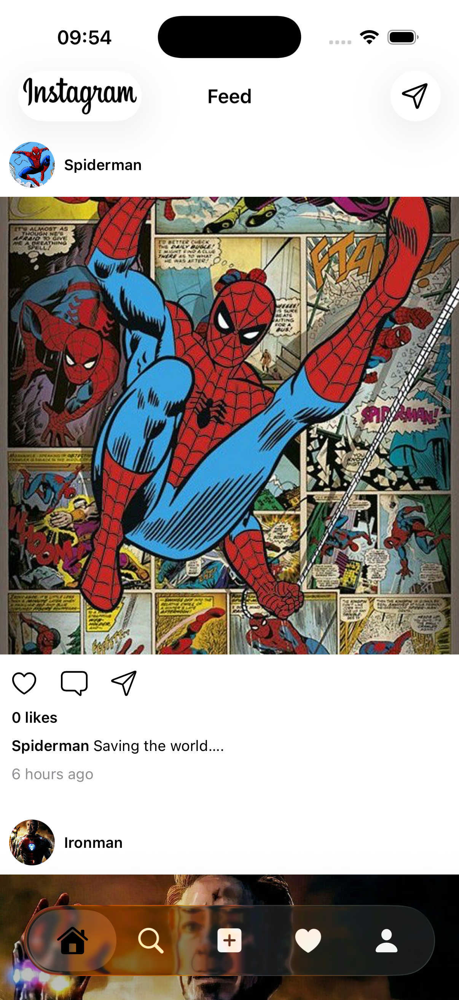
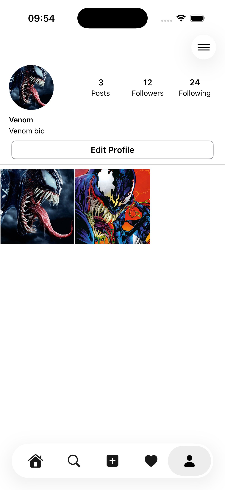
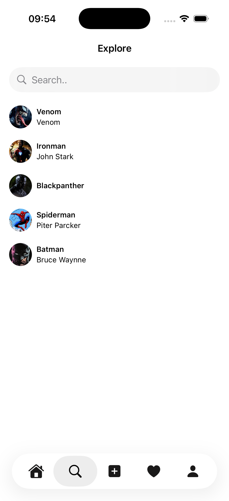

# Instagram Clone Tutorial - SwiftUI

A comprehensive iOS Instagram clone built with SwiftUI to explore modern iOS development, networking, Firebase integration, and contemporary app architecture patterns.

## 📱 App Screenshots

<div align="center">
  <table>
    <tr>
      <td align="center">
        
        <br><b>Login Screen</b>
      </td>
      <td align="center">
        
        <br><b>Feed Screen</b>
      </td>
    </tr>
    <tr>
      <td align="center">
        
        <br><b>Search & Discovery</b>
      </td>
      <td align="center">
        
        <br><b>User Profile</b>
      </td>
    </tr>
  </table>
</div>

## 🎯 Project Overview

This project serves as a hands-on exploration of:
- **SwiftUI Framework**: Modern declarative UI development for iOS 18.5+
- **Firebase Integration**: Authentication, Firestore database, and cloud storage
- **Networking**: Async/await patterns and real-time data synchronization
- **iOS Architecture**: MVVM pattern with modern Observation framework
- **Modern iOS Features**: PhotosPicker, NavigationStack, and iOS 17+ APIs

## 🏗 Architecture & Design Patterns

### **SwiftUI + MVVM Architecture**
- **View Layer**: SwiftUI views with declarative UI components
- **ViewModel Layer**: `@Observable` classes using iOS 17+ Observation framework
- **Service Layer**: Singleton services for Firebase authentication, user management, and data operations
- **Model Layer**: Codable data models with Firebase integration

### **Key Technologies**
- **SwiftUI**: Declarative UI framework with iOS 18.5+ features
- **Firebase SDK 12.1.0**: Authentication, Firestore, and Storage
- **Combine Framework**: Reactive programming for data binding
- **PhotosPicker**: Native iOS photo selection
- **Async/Await**: Modern Swift concurrency patterns

## 🚀 Features Implemented

### **✅ Authentication System**
- Complete email/password registration and login flow
- Firebase Authentication integration with real-time session management
- Multi-step registration process (email → username → password → completion)
- Secure user data storage in Firestore with proper error handling
- Facebook login integration option
- "Forgot Password" functionality

### **✅ User Management & Profiles**
- Complete user profile system with stats (posts, followers, following)
- Profile image upload and management via Firebase Storage
- Edit profile functionality with real-time updates
- Bio and personal information management
- User search and discovery with live results
- Profile grid displaying user's posts

### **✅ Feed & Post System**
- Fully functional Instagram-style feed with real-time post loading
- Complete post creation workflow with PhotosPicker integration
- Post upload to Firebase Storage with automatic image processing
- Post metadata storage in Firestore with user relationship linking
- Complete like/unlike functionality with real-time updates and Firebase integration
- Full comments system with real-time posting and fetching from Firebase
- Optimistic UI updates for instant comment display with user data pre-population
- Post display with user profile integration and timestamps
- LazyVStack implementation for smooth scrolling performance

### **✅ Search & Discovery**
- Real-time user search functionality
- Dynamic user list with profile images and usernames
- Search results with character profiles (Venom, Ironman, Batman, etc.)
- Instant search filtering and responsive UI

### **✅ Navigation & UI Components**
- Complete 5-tab navigation system (Feed, Search, Upload, Notifications, Profile)
- Custom reusable components (CircularProfileImageView, UserStatView, PostGridView)
- iOS 16+ NavigationStack implementation
- Custom SwiftUI modifiers and styling
- Responsive design optimized for iPhone and iPad
- Native iOS design patterns and animations

## 📱 App Structure

```
InstagramCloneTutorial/
├── App/
│   └── InstagramCloneTutorialApp.swift           # App entry point with Firebase configuration
├── Core/
│   ├── Authentication/                           # Complete authentication system
│   │   ├── Service/AuthService.swift             # Firebase Auth integration
│   │   ├── ViewModel/                            # LoginViewModel, RegistrationViewModel
│   │   └── View/                                # Login, Registration flow screens
│   ├── Feed/                                    # Main timeline functionality
│   │   ├── View/FeedView.swift, FeedCell.swift  # Feed UI components
│   │   └── ViewModel/FeedViewModel.swift         # Feed data management
│   ├── Comments/                                # Comments system
│   │   ├── Model/Comment.swift                  # Comment data model
│   │   ├── Service/CommentService.swift         # Firebase comment operations
│   │   ├── View/CommentsView.swift, CommentsCell.swift  # Comment UI components
│   │   └── ViewModel/CommentViewModel.swift      # Comment data management
│   ├── Search/                                  # User discovery system
│   │   ├── View/SearchView.swift                # Search interface
│   │   └── ViewModel/SearchViewModel.swift       # Search functionality
│   ├── Profile/                                 # Complete profile system
│   │   ├── View/                                # ProfileView, EditProfileView, etc.
│   │   └── ViewModel/EditProfileViewModel.swift # Profile management
│   ├── UploadPosts/                             # Post creation system
│   │   ├── View/UploadPostView.swift            # Post upload interface
│   │   └── ViewModel/UploadPostViewModel.swift   # Upload functionality
│   ├── Components/                              # Reusable UI components
│   │   ├── View/CircularProfileImageView.swift  # Profile image component
│   │   ├── View/PostGridView.swift              # Post grid display
│   │   ├── View/UserStatView.swift              # User statistics
│   │   └── ViewModel/PostGridViewModel.swift     # Grid data management
│   ├── TabBar/MainTabView.swift                 # Main navigation container
│   └── Root/                                    # App root management
│       ├── View/ContentView.swift               # Root content view
│       └── ViewModel/ContentViewModel.swift      # App state management
├── Model/
│   ├── User.swift                               # User data model with Firebase integration
│   └── Post.swift                               # Post data model with user linking
├── Services/
│   ├── UserService.swift                        # Singleton service for user data and state management
│   ├── PostService.swift                        # Post data operations
│   └── ImageUploader.swift                      # Firebase Storage image handling
├── Assets.xcassets/                             # App icons and character images
└── Screenshots/                                 # App screenshot collection
```

## 🛠 Technical Implementation

### **Firebase Integration**
```swift
// Authentication with async/await
func createUser(email: String, password: String, username: String) async throws {
    let result = try await Auth.auth().createUser(withEmail: email, password: password)
    await uploadUserData(uid: result.user.uid, username: username, email: email)
}

// Firestore data operations with singleton pattern
func fetchAllUsers() async throws -> [User] {
    let snapshot = try await Firestore.firestore().collection("users").getDocuments()
    return snapshot.documents.compactMap({ try? $0.data(as: User.self) })
}

// Centralized user state management
UserService.shared.currentUser // Accessible throughout the app
```

### **Modern SwiftUI Patterns**
```swift
// iOS 17+ Observation framework
@Observable
class UploadPostViewModel {
    var selectedImage: PhotosPickerItem?
    var postImage: Image?
    
    func loadImage(fromItem item: PhotosPickerItem?) async {
        // Modern async image loading
    }
}
```

### **Reactive Data Binding**
```swift
// Combine integration for real-time updates
service.$userSession.sink { [weak self] userSession in
    self?.userSession = userSession
}.store(in: &cancellables)

UserService.shared.$currentUser.sink { [weak self] currentUser in
    self?.currentUser = currentUser
}.store(in: &cancellables)
```

## 🏃‍♂️ Getting Started

### **Prerequisites**
- Xcode 16.4+
- iOS 18.5+ deployment target
- Swift 5.0
- Firebase project setup

### **Setup Instructions**
1. Clone the repository
2. Open `InstagramCloneTutorial.xcodeproj` in Xcode
3. Configure Firebase:
   - Create your own Firebase project at [Firebase Console](https://console.firebase.google.com)
   - Add your `GoogleService-Info.plist` to the project root (this file is gitignored for security)
   - Update bundle ID to match your Firebase project
   - Enable Authentication and Firestore in Firebase Console
4. Build and run on iOS Simulator or device

> **⚠️ Security Note**: Never commit Firebase configuration files (`GoogleService-Info.plist`) to version control. This project includes these files in `.gitignore` to prevent accidental exposure of API keys and sensitive configuration data.

### **Firebase Configuration**
The project includes Firebase SDK dependencies:
- FirebaseAuth (Authentication)
- FirebaseFirestore (Database)
- FirebaseStorage (File storage)

## 🎓 Learning Objectives

This project demonstrates:
- **Modern iOS Development**: SwiftUI, iOS 17+ APIs, and contemporary patterns
- **Firebase Integration**: Real-time database operations and authentication
- **Networking Concepts**: Async/await, error handling, and data synchronization
- **App Architecture**: MVVM with reactive programming principles
- **UI/UX Implementation**: Native iOS design patterns and user interactions

## 🔧 Development Status

**✅ Fully Implemented Features:**
- Complete Firebase Authentication system with multi-step registration
- User profile management with edit functionality and statistics
- Real-time user search and discovery with live filtering
- Full post creation and upload system with Firebase Storage integration
- Instagram-style feed with real-time post loading and user linking
- Interactive like/unlike system with optimistic updates and Firebase persistence
- Complete commenting system with real-time posting, fetching, and optimistic UI updates
- Profile image upload and management
- Post grid display on user profiles
- Native photo selection with PhotosPicker integration
- Complete tab-based navigation system
- Centralized user state management with singleton pattern

**🚧 Advanced Features (Future Enhancements):**
- Push notifications for user interactions
- Advanced image filtering and editing tools
- Stories functionality
- Direct messaging system
- Image caching and optimization
- Offline data synchronization
- Advanced user interaction analytics

## 📚 Key Learning Resources

This project explores concepts from:
- SwiftUI documentation and modern iOS development
- Firebase iOS SDK integration patterns
- Modern Swift concurrency and async programming
- iOS app architecture best practices
- Real-time data synchronization techniques

## 📖 Course Attribution

This project is developed as part of the **AppStuff Instagram SwiftUI Pro 2.0** course. The implementation follows the course curriculum while exploring advanced SwiftUI concepts, Firebase integration, and modern iOS development practices.

---

*This project is designed for educational purposes to explore SwiftUI, Firebase integration, and modern iOS development patterns.*